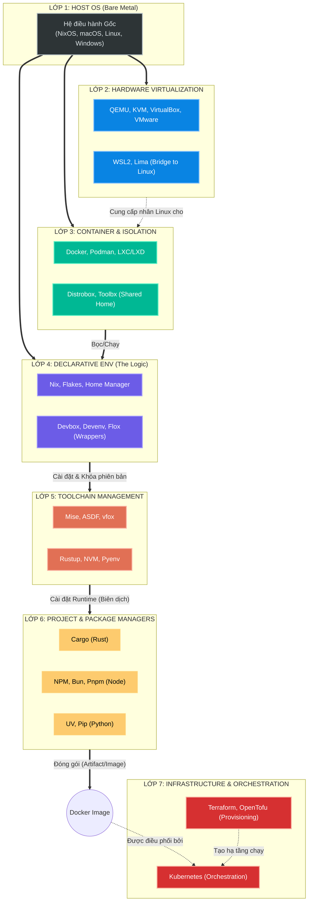

# Dotfiles

## Toàn cảnh Hệ sinh thái Môi trường & Hạ tầng (The Full Stack Taxonomy)

```mermaid
flowchart TD
    %% Định nghĩa các lớp màu sắc (Styling)
    classDef hardware fill:#2d3436,stroke:#b2bec3,stroke-width:2px,color:#dfe6e9
    classDef virt fill:#0984e3,stroke:#74b9ff,stroke-width:2px,color:#fff
    classDef container fill:#00b894,stroke:#55efc4,stroke-width:2px,color:#fff
    classDef declarative fill:#6c5ce7,stroke:#a29bfe,stroke-width:2px,color:#fff
    classDef toolchain fill:#e17055,stroke:#fab1a0,stroke-width:2px,color:#fff
    classDef package fill:#fdcb6e,stroke:#ffeaa7,stroke-width:1px,color:#000
    classDef infra fill:#d63031,stroke:#fab1a0,stroke-width:2px,color:#fff

    %% Lớp 1: Nền tảng (The Host)
    subgraph L1 ["LỚP 1: HOST OS (Bare Metal)"]
        OS["Hệ điều hành Gốc<br/>(NixOS, macOS, Linux, Windows)"]:::hardware
    end

    %% Lớp 2: Ảo hóa (Virtualization)
    subgraph L2 ["LỚP 2: HARDWARE VIRTUALIZATION"]
        Hypervisor["QEMU, KVM, VirtualBox, VMware"]:::virt
        GuestBridge["WSL2, Lima (Bridge to Linux)"]:::virt
    end

    %% Lớp 3: Cô lập (Containerization)
    subgraph L3 ["LỚP 3: CONTAINER & ISOLATION"]
        Runtime["Docker, Podman, LXC/LXD"]:::container
        UserEnv["Distrobox, Toolbx (Shared Home)"]:::container
    end

    %% Lớp 4: Khai báo môi trường (Declarative Foundations)
    subgraph L4 ["LỚP 4: DECLARATIVE ENV (The Logic)"]
        NixEngine["Nix, Flakes, Home Manager"]:::declarative
        Abstraction["Devbox, Devenv, Flox (Wrappers)"]:::declarative
    end

    %% Lớp 5: Quản lý Toolchain (Version Managers)
    subgraph L5 ["LỚP 5: TOOLCHAIN MANAGEMENT"]
        Polyglot["Mise, ASDF, vfox"]:::toolchain
        Specialist["Rustup, NVM, Pyenv"]:::toolchain
    end

    %% Lớp 6: Quản lý Gói & Dự án (Package Managers)
    subgraph L6 ["LỚP 6: PROJECT & PACKAGE MANAGERS"]
        RustPkgs["Cargo (Rust)"]:::package
        NodePkgs["NPM, Bun, Pnpm (Node)"]:::package
        PyPkgs["UV, Pip (Python)"]:::package
    end

    %% Lớp 7: Hạ tầng quy mô lớn (Cloud/Infra)
    subgraph L7 ["LỚP 7: INFRASTRUCTURE & ORCHESTRATION"]
        IaC["Terraform, OpenTofu (Provisioning)"]:::infra
        K8s["Kubernetes (Orchestration)"]:::infra
    end

    %% Mối quan hệ logic
    OS ==> L2
    OS ==> L3
    OS ==> L4
    
    L2 -.->|"Cung cấp nhân Linux cho"| L3
    L3 ==>|"Bọc/Chạy"| L4
    
    L4 ==>|"Cài đặt & Khóa phiên bản"| L5
    L5 ==>|"Cài đặt Runtime (Biên dịch)"| L6
    
    L6 ==>|"Đóng gói (Artifact/Image)"| Image(("Docker Image"))
    Image -.->|"Được điều phối bởi"| K8s
    IaC -.->|"Tạo hạ tầng chạy"| K8s
```

